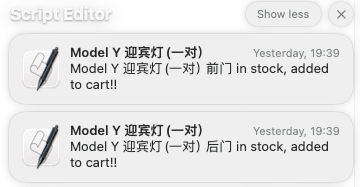

# 脚本功能

特斯拉中国官网最近上架的迎宾灯很抢手，一上架就被抢一空，楼主手慢也没抢到。。。
官网显示，最新到货时间估计是月底，但没有给出具体时间，为了避免再次失手，撸了这个脚本来辅助监控库存。

## 脚本逻辑
该脚本运行时，会启动一个Google Chrome浏览器窗口，脚本自动在窗口中进行模拟人工操作，在将商品加入购物车前无需人工干预。
当脚本检测商品暂无库存时，脚本每隔10秒钟循环发起检查（检测间隔可自行修改*check_interval*值，不建议太频繁，以避免被风控）。
当脚本检测到有商品有库存时，会自动将两个型号加入购物车，加购物车后会自动跳转到购物车页面，此时需要**手工点结账，登录自己的账户进行后续的收货地址填写、在线付款等操作**（此时会有弹窗通知）。强烈建议收到通知后进行登录付款以锁定库存。脚本启动的浏览器窗口在加购物车成功后只保留30分钟（可自行修改*hold_time*值）。

当检测到库存时会有弹窗通知（详见各操作系统的通知功能），在Mac下还可以给手机发iMessage提醒（需要将代码中 *mobile_phone* 修改为正确的手机号码）。

## 扩展性
特斯拉商店各商品的网页结构都差不多，对该脚本做适当调整，应该也可以支持其它商品的库存监控和加购。
比如将 *url_puddle* 改为Model3迎宾灯的网址，就可以抢购Model3的迎宾灯了。

# 安装与运行

该脚本可以在Mac/Windows下运行，需要 selenium、beautifulsoup4、plyer等Python包，如果当前运行环境中没有，需要预先安装：  
`pip install selenium`    
`pip install beautifulsoup4`  
`pip install plyer`  
然后直接运行脚本即可(需Python3.8以上)：   
`python tesla_stock_check`

